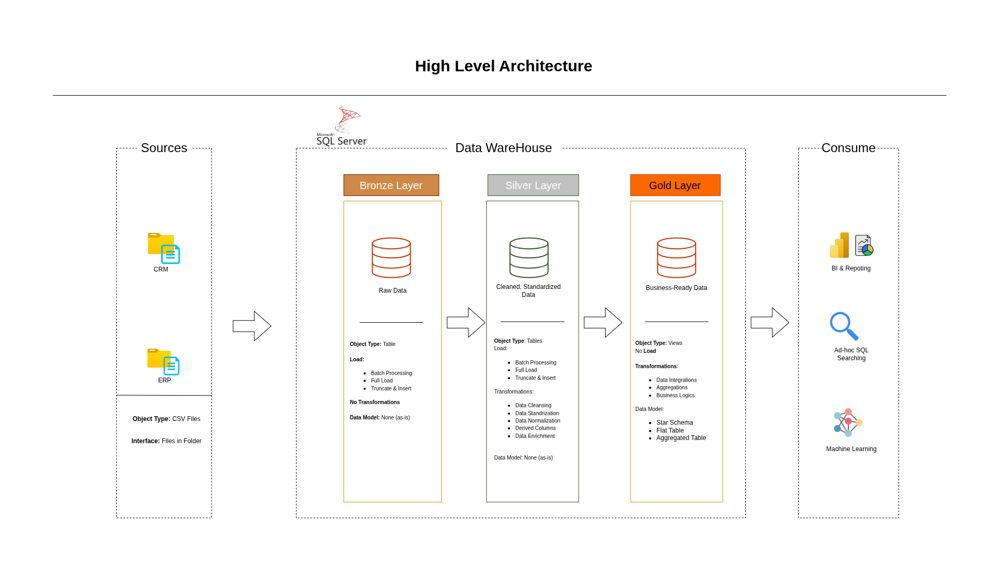

# 📊 Data Warehouse and Analytics Project

Welcome to the **Data Warehouse and Analytics Project** repository! 🚀  
This portfolio project demonstrates a complete end-to-end data warehousing and analytics solution — from building a modern data warehouse to delivering actionable business insights using SQL.

---

## 🏗️ Data Architecture: Medallion Layers

We adopt the **Medallion Architecture** consisting of **Bronze**, **Silver**, and **Gold** layers to organize and transform data effectively.



- **Bronze Layer**: Stores raw data ingested from CSV files into SQL Server.
- **Silver Layer**: Cleansed and standardized data prepared for analysis.
- **Gold Layer**: Final business-ready data modeled into a **Star Schema** for reporting and analytics.

---

## 📖 Project Overview

This project includes:

1. **Data Architecture Design** – Using Medallion layered structure.
2. **ETL Pipelines** – Extraction, Transformation, and Loading of ERP and CRM data.
3. **Data Modeling** – Star schema design using fact and dimension tables.
4. **Analytics & Reporting** – SQL-based insights into customer behavior, sales, and product trends.

🎯 Ideal for showcasing skills in:
- SQL Development
- Data Warehousing
- ETL Development
- Data Engineering
- Data Modeling
- Business Intelligence & Analytics

---

## 🛠️ Tools & Resources

Everything is **Free & Open Source** 🎉

| Tool/Link | Description |
|----------|-------------|
| [Datasets](datasets/) | CSV files for ERP & CRM systems |
| [SQL Server Express](https://www.microsoft.com/en-us/sql-server/sql-server-downloads) | Lightweight RDBMS |
| [Azure Data Studio]([https://learn.microsoft.com/en-us/sql/ssms/download-sql-server-management-studio-ssms?view=sql-server-ver16](https://azure.microsoft.com/en-us/products/data-studio) | Azure Data Studio|
| [Draw.io](https://www.drawio.com/) | Data modeling & architecture diagrams |
| [Project Template (Notion)](https://abdulalimswe.notion.site/Data-Warehouse-Project-21244dbfc2ea80b8967ce4243900447c?pvs=73) | Project planning template |

---

## 🚀 Project Requirements

### 🔧 Data Engineering

- **Source Systems**: ERP & CRM datasets (CSV)
- **Data Cleansing**: Handle missing values, duplicates, standardization
- **Integration**: Merge sources into one unified model
- **Modeling**: Build star schema (Fact & Dimension tables)
- **Documentation**: Fully documented ETL flow & data catalog

### 📊 Data Analytics & Reporting

- SQL queries and insights into:
  - 🧑‍🤝‍🧑 Customer Behavior
  - 📦 Product Performance
  - 💰 Sales Trends

Refer to [`docs/documents.md`](docs/documents.md) for full details.

---

## 📂 Repository Structure

```
data-warehouse-project/
│
├── datasets/                           # Raw datasets used for the project (ERP and CRM data)
│
├── docs/                               # Project documentation and architecture details
│   ├── etl.drawio                      # Draw.io file shows all different techniquies and methods of ETL
│   ├── data_architecture.drawio        # Draw.io file shows the project's architecture
│   ├── data_catalog.md                 # Catalog of datasets, including field descriptions and metadata
│   ├── data_flow.drawio                # Draw.io file for the data flow diagram
│   ├── data_models.drawio              # Draw.io file for data models (star schema)
│   ├── naming-conventions.md           # Consistent naming guidelines for tables, columns, and files
│
├── scripts/                            # SQL scripts for ETL and transformations
│   ├── bronze/                         # Scripts for extracting and loading raw data
│   ├── silver/                         # Scripts for cleaning and transforming data
│   ├── gold/                           # Scripts for creating analytical models
│
├── tests/                              # Test scripts and quality files
│
├── README.md                           # Project overview and instructions
├── LICENSE                             # License information for the repository
├── .gitignore                          # Files and directories to be ignored by Git
└── requirements.txt                    # Dependencies and requirements for the project
```
---

## 🛡️ License

This project is licensed under the [MIT License](LICENSE).  

---

